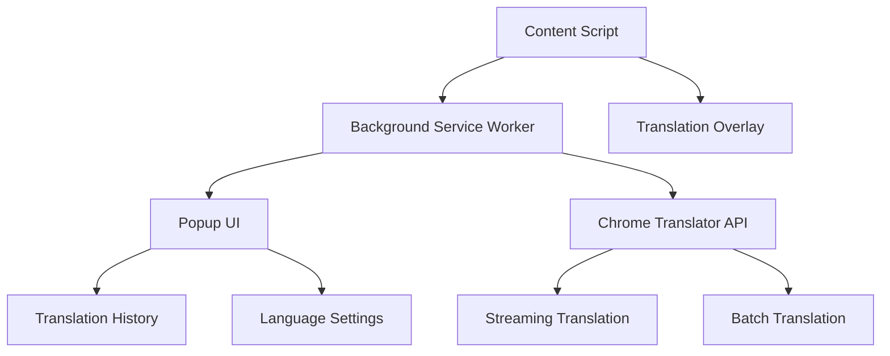

# 设计文档

## 概述

Chrome AI翻译扩展是一个基于Chrome内置Translator API的浏览器扩展，使用Vite + Vue 3构建。扩展提供网页文本选择翻译、语言配置、翻译历史和流式翻译功能。采用类似Element Plus的UI设计风格，支持离线翻译能力。

### 核心技术栈
- **构建工具**: Vite 5.x
- **前端框架**: Vue 3 (Composition API + `<script setup>`)
- **UI框架**: 自定义组件库（Element Plus风格）
- **翻译API**: Chrome内置Translator API
- **扩展规范**: Chrome Extension Manifest V3
- **样式**: CSS3 + CSS变量主题系统
- **存储**: Chrome Storage API

## 架构

### 整体架构图



### 扩展组件结构

```
chrome-ai-translator/
├── manifest.json                 # Manifest V3配置
├── src/
│   ├── background/              # Service Worker
│   │   └── service-worker.js
│   ├── content/                 # Content Scripts
│   │   ├── content-script.js
│   │   └── overlay.js
│   ├── popup/                   # 弹窗UI
│   │   ├── main.js
│   │   ├── App.vue
│   │   └── components/
│   ├── shared/                  # 共享模块
│   │   ├── translator.js
│   │   ├── storage.js
│   │   └── constants.js
│   └── styles/                  # 样式文件
│       ├── theme.css
│       └── components.css
├── public/
│   └── icons/
└── dist/                        # 构建输出
```

## 组件和接口

### 1. Chrome Translator API 封装

```javascript
// src/shared/translator.js
class TranslatorService {
  constructor() {
    this.checkBrowserSupport()
  }
  
  checkBrowserSupport() {
    if (!('Translator' in self)) {
      throw new Error('当前浏览器版本不支持AI翻译功能，请升级到Chrome 138或更高版本')
    }
  }
  
  async checkAvailability(sourceLanguage, targetLanguage)
  async createTranslator(sourceLanguage, targetLanguage)
  async translate(text, options = {})
  async translateStreaming(text, onChunk)
  async getSupportedLanguages()
}
```

### 2. 存储管理器

```javascript
// src/shared/storage.js
class StorageManager {
  async getLanguagePreferences()
  async setLanguagePreferences(source, target)
  async getTranslationHistory()
  async addTranslationHistory(item)
  async clearHistory()
  async getSettings()
  async updateSettings(settings)
}
```

### 3. Content Script 组件

```javascript
// src/content/content-script.js
class ContentTranslator {
  handleTextSelection()
  showTranslationOverlay(selectedText, position)
  hideOverlay()
  injectTranslationUI()
}
```

### 4. Vue 组件架构

#### 主应用组件
```vue
<!-- src/popup/App.vue -->
<template>
  <div class="translator-app">
    <LanguageSelector />
    <TranslationInput />
    <TranslationResult />
    <TranslationHistory />
  </div>
</template>
```

#### 核心组件列表
- `LanguageSelector.vue` - 语言选择器
- `TranslationInput.vue` - 翻译输入区域
- `TranslationResult.vue` - 翻译结果显示
- `TranslationHistory.vue` - 翻译历史列表
- `TranslationDetail.vue` - 翻译详情弹窗
- `StreamingIndicator.vue` - 流式翻译进度指示器
- `OverlayPopup.vue` - 网页覆盖翻译弹窗

## 数据模型

### 1. 翻译项模型

```typescript
interface TranslationItem {
  id: string
  sourceText: string
  translatedText: string
  sourceLanguage: string
  targetLanguage: string
  timestamp: number
  isStreaming?: boolean
}
```

### 2. 语言配置模型

```typescript
interface LanguagePreferences {
  sourceLanguage: string
  targetLanguage: string
  autoDetectSource: boolean
  preferredLanguages: string[]
}
```

### 3. 扩展设置模型

```typescript
interface ExtensionSettings {
  theme: 'light' | 'dark' | 'auto'
  showOverlay: boolean
  overlayPosition: 'top' | 'bottom' | 'auto'
  enableStreaming: boolean
  streamingThreshold: number
  historyLimit: number
}
```

### 4. API可用性模型

```typescript
interface TranslatorAvailability {
  available: boolean
  downloadable: boolean
  downloading: boolean
  downloadProgress?: number
  error?: string
}
```

## UI设计系统

### 色彩主题（Element Plus风格）

```css
:root {
  /* 主色调 */
  --primary-color: #409eff;
  --primary-light: #79bbff;
  --primary-dark: #337ecc;
  
  /* 成功色 */
  --success-color: #67c23a;
  --success-light: #95d475;
  --success-dark: #529b2e;
  
  /* 警告色 */
  --warning-color: #e6a23c;
  --warning-light: #ebb563;
  --warning-dark: #b88230;
  
  /* 错误色 */
  --error-color: #f56c6c;
  --error-light: #f78989;
  --error-dark: #c45656;
  
  /* 中性色 */
  --text-primary: #303133;
  --text-regular: #606266;
  --text-secondary: #909399;
  --text-placeholder: #c0c4cc;
  
  /* 边框色 */
  --border-base: #dcdfe6;
  --border-light: #e4e7ed;
  --border-lighter: #ebeef5;
  --border-extra-light: #f2f6fc;
  
  /* 背景色 */
  --bg-color: #ffffff;
  --bg-page: #f2f3f5;
  --bg-overlay: rgba(0, 0, 0, 0.8);
}
```

### 组件样式规范

```css
/* 按钮样式 */
.btn {
  padding: 8px 16px;
  border-radius: 4px;
  border: 1px solid var(--border-base);
  font-size: 14px;
  transition: all 0.3s;
}

.btn--primary {
  background: var(--primary-color);
  color: white;
  border-color: var(--primary-color);
}

/* 输入框样式 */
.input {
  padding: 8px 12px;
  border: 1px solid var(--border-base);
  border-radius: 4px;
  font-size: 14px;
  transition: border-color 0.3s;
}

.input:focus {
  border-color: var(--primary-color);
  outline: none;
}

/* 卡片样式 */
.card {
  background: var(--bg-color);
  border: 1px solid var(--border-lighter);
  border-radius: 8px;
  box-shadow: 0 2px 8px rgba(0, 0, 0, 0.1);
}
```

## 错误处理

### 1. API错误处理策略

```javascript
class ErrorHandler {
  static handleTranslatorError(error) {
    switch (error.type) {
      case 'LANGUAGE_NOT_SUPPORTED':
        return '不支持的语言对'
      case 'MODEL_NOT_AVAILABLE':
        return '翻译模型不可用，请稍后再试'
      case 'STORAGE_INSUFFICIENT':
        return '存储空间不足，无法下载翻译模型'
      case 'API_NOT_SUPPORTED':
        return '当前浏览器版本不支持AI翻译功能，请升级到Chrome 138或更高版本'
      default:
        return '翻译失败，请重试'
    }
  }
  
  static checkBrowserSupport() {
    if (!('Translator' in self)) {
      throw new Error('当前浏览器版本不支持AI翻译功能，请升级到Chrome 138或更高版本')
    }
  }
}
```

### 2. 用户体验错误处理

- **浏览器不支持**: 提示用户升级到Chrome 138或更高版本
- **模型下载失败**: 显示重试按钮和下载进度
- **语言不支持**: 提供替代语言建议
- **存储空间不足**: 提示清理空间或选择其他语言对
- **权限错误**: 引导用户授权必要权限

### 3. 降级策略

```javascript
class FallbackStrategy {
  async translateWithFallback(text, sourceLanguage, targetLanguage) {
    try {
      // 检查模型可用性
      const availability = await Translator.availability({
        sourceLanguage,
        targetLanguage
      })
      
      if (availability === 'available') {
        return await this.chromeTranslate(text, sourceLanguage, targetLanguage)
      } else if (availability === 'downloadable') {
        // 提示用户下载模型
        return this.promptModelDownload(sourceLanguage, targetLanguage)
      } else {
        // 语言对不支持
        return this.suggestAlternativeLanguages(sourceLanguage, targetLanguage)
      }
    } catch (error) {
      return this.handleTranslationError(error)
    }
  }
}
```

## 离线翻译能力

### 1. Chrome内置AI模型

Chrome内置的Translator API使用本地AI模型进行翻译，具有以下特点：

- **完全离线**: 翻译过程不需要网络连接，保护用户隐私
- **本地处理**: 所有翻译计算在用户设备上完成
- **快速响应**: 无需网络往返，翻译速度更快
- **隐私保护**: 翻译内容不会发送到外部服务器

### 2. 模型管理

```javascript
// 模型可用性检查和下载管理
class ModelManager {
  async checkModelAvailability(sourceLanguage, targetLanguage) {
    const availability = await Translator.availability({
      sourceLanguage,
      targetLanguage
    })
    return availability // 'available', 'downloadable', 'downloading'
  }
  
  async downloadModel(sourceLanguage, targetLanguage, onProgress) {
    const translator = await Translator.create({
      sourceLanguage,
      targetLanguage,
      monitor(m) {
        m.addEventListener('downloadprogress', onProgress)
      }
    })
    return translator
  }
}
```

### 3. 离线优先设计

- **模型预下载**: 根据用户语言偏好预下载常用语言对模型
- **智能缓存**: 缓存已下载的模型，避免重复下载
- **存储管理**: 监控设备存储空间，合理管理模型文件
- **降级提示**: 当模型不可用时，提供清晰的用户指引

## 内存缓存系统

### 1. Vue Computed 缓存

```vue
<!-- Vue组件中的内存缓存实现 -->
<script setup>
import { ref, computed } from 'vue'

// 翻译缓存Map
const translationCache = ref(new Map())

// 生成缓存键
const generateCacheKey = (text, sourceLang, targetLang) => {
  return `${text.trim()}|${sourceLang}|${targetLang}`
}

// 检查缓存
const cachedTranslation = computed(() => {
  if (!inputText.value || !sourceLanguage.value || !targetLanguage.value) {
    return null
  }
  
  const key = generateCacheKey(inputText.value, sourceLanguage.value, targetLanguage.value)
  return translationCache.value.get(key) || null
})

// 缓存翻译结果
const cacheTranslation = (text, sourceLang, targetLang, result) => {
  const key = generateCacheKey(text, sourceLang, targetLang)
  translationCache.value.set(key, result)
}
</script>
```

### 2. 缓存策略

- **内存缓存**: 使用Vue的响应式Map存储翻译结果
- **会话级别**: 缓存仅在组件生命周期内有效
- **自动清理**: 组件销毁时自动清理缓存
- **简单高效**: 无需复杂的过期和大小管理


## 性能优化

### 1. 翻译性能优化

- **内存缓存**: 使用computed缓存翻译结果，避免重复API调用
- **文本分块**: 长文本分块处理，避免单次翻译过大
- **流式处理**: 使用流式API提升用户体验
- **防抖处理**: 避免频繁的翻译请求

### 2. UI性能优化

- **虚拟滚动**: 翻译历史列表使用虚拟滚动
- **懒加载**: 组件按需加载
- **CSS优化**: 使用CSS变量和高效选择器
- **动画优化**: 使用CSS transform和opacity

### 3. 内存管理

- **翻译器实例管理**: 合理创建和销毁翻译器实例
- **历史记录限制**: 限制历史记录数量，定期清理
- **事件监听器清理**: 及时移除不需要的事件监听器

## 安全考虑

### 1. 权限最小化

```json
{
  "permissions": [
    "storage",
    "activeTab"
  ],
  "host_permissions": [
    "<all_urls>"
  ]
}
```

### 2. 内容安全策略

```json
{
  "content_security_policy": {
    "extension_pages": "script-src 'self'; object-src 'self'"
  }
}
```

### 3. 数据隐私

- **本地存储**: 翻译历史仅存储在本地
- **数据加密**: 敏感设置使用加密存储
- **权限控制**: 严格控制跨域访问权限

## 部署和分发

### 1. 构建配置

```javascript
// vite.config.js
export default defineConfig({
  build: {
    rollupOptions: {
      input: {
        popup: 'src/popup/main.js',
        content: 'src/content/content-script.js',
        background: 'src/background/service-worker.js'
      },
      output: {
        entryFileNames: '[name].js',
        chunkFileNames: '[name].js',
        assetFileNames: '[name].[ext]'
      }
    }
  }
})
```

### 2. Chrome Web Store发布

- **图标设计**: 提供16x16, 48x48, 128x128像素图标
- **截图准备**: 准备1280x800或640x400像素的截图
- **描述文档**: 准备详细的功能描述和使用说明
- **隐私政策**: 编写符合要求的隐私政策

### 3. 版本管理

- **语义化版本**: 使用语义化版本号管理
- **更新机制**: 支持自动更新和增量更新
- **回滚策略**: 准备版本回滚方案